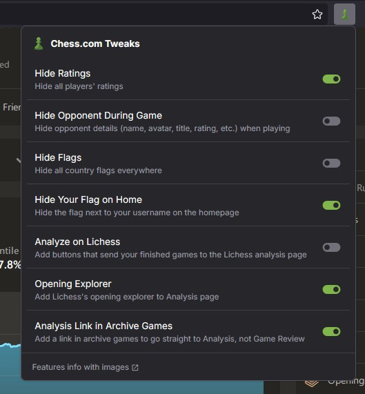
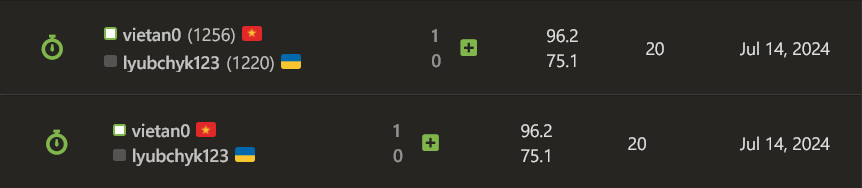
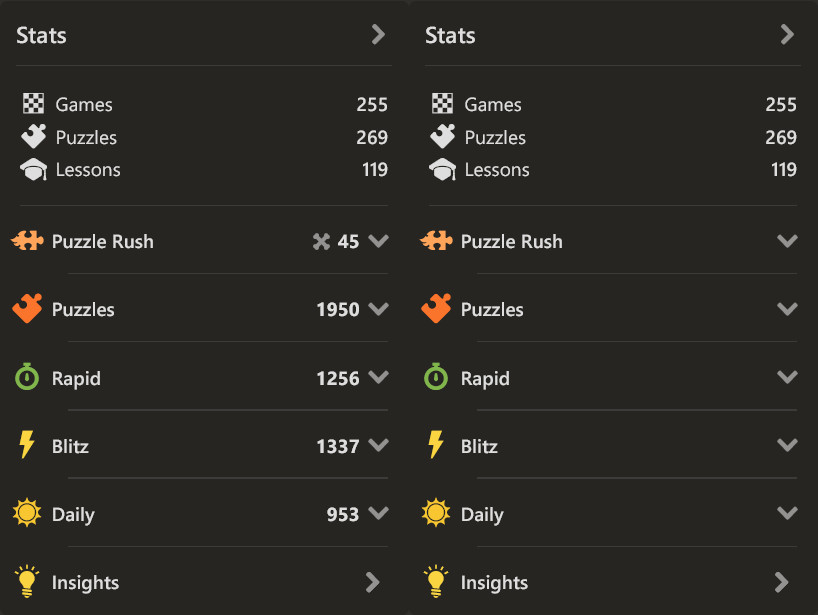
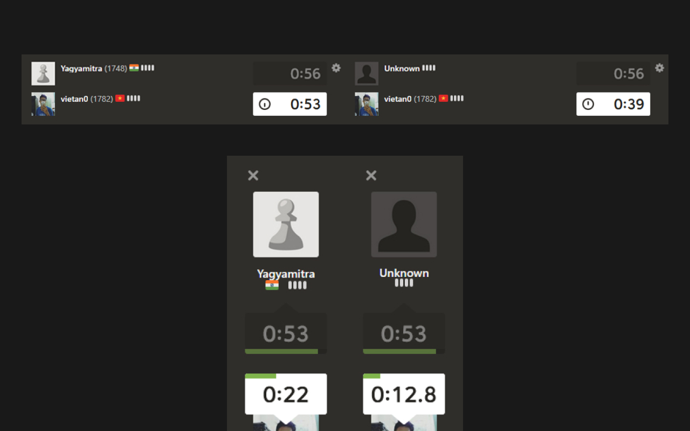
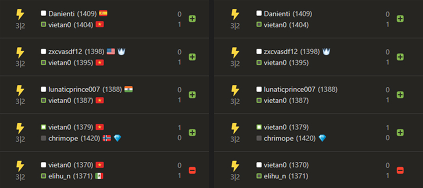
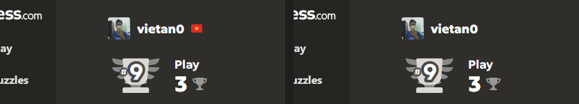
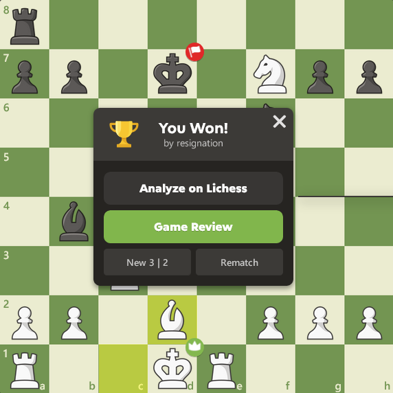
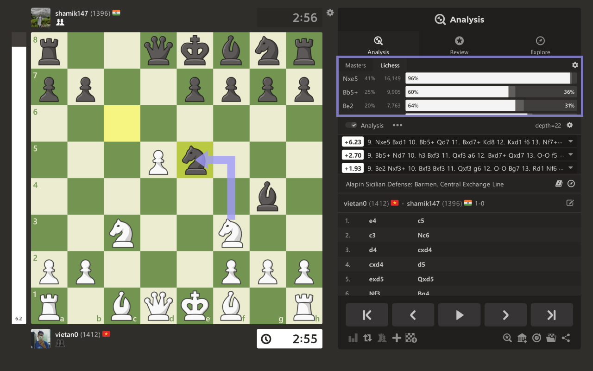
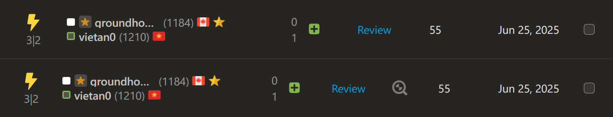

# Chess.com Tweaks - Hide ratings, hide opponent and more!

Chess.com Tweaks is a Firefox extension that enhances your Chess.com experience by decluttering the interface and providing additional analysis tools.

## Features

### Hide Ratings

Hide all players' ratings in games and stats.

### Hide Opponent During Game

Hide opponent details (name, avatar, title, rating, etc.) when playing

### Hide Flags

Hide all country flags everywhere

### Hide Own Flag On Home

Hide the flag next to your username on the homepage

### Analyze on Lichess

Add buttons that send your finished games to the Lichess analysis page

### Opening Explorer

Add Lichess's opening explorer to Analysis page

### Analysis Link in Archive Games

Add a link in archive games to go straight to Analysis, not Game Review

