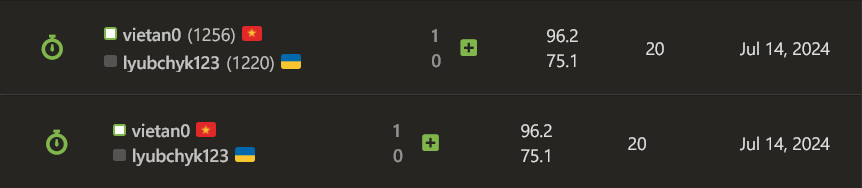
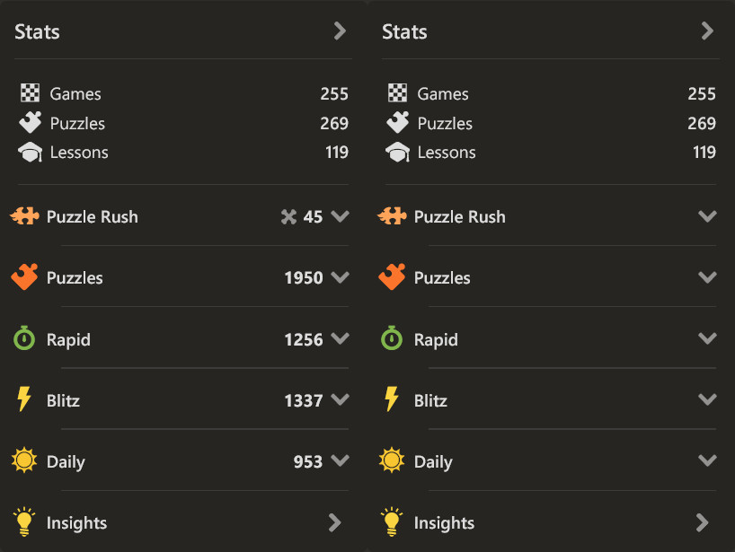
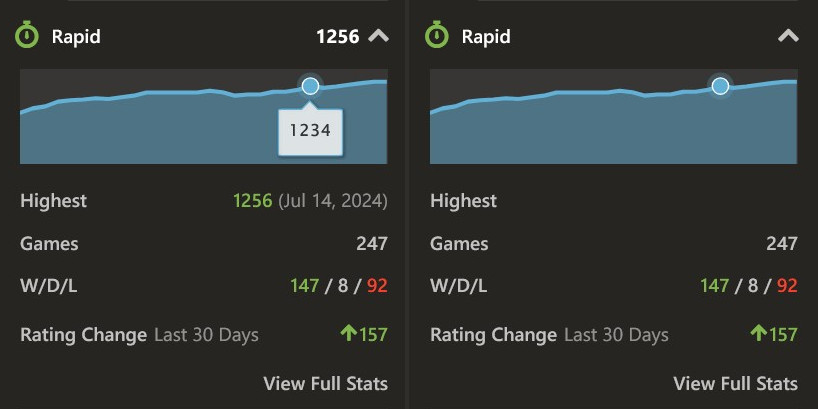
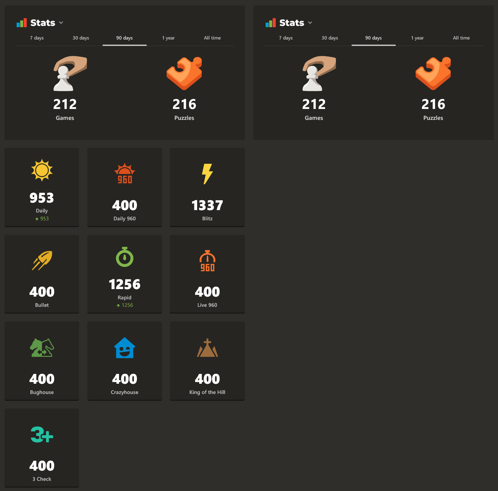
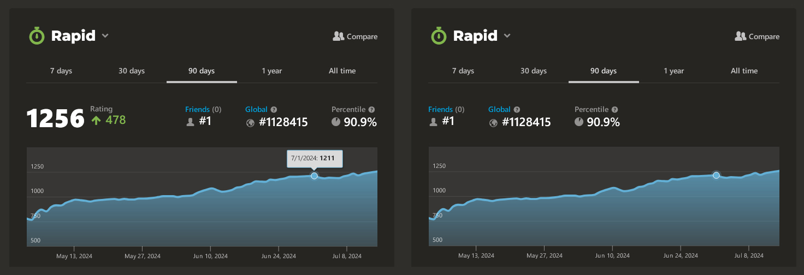
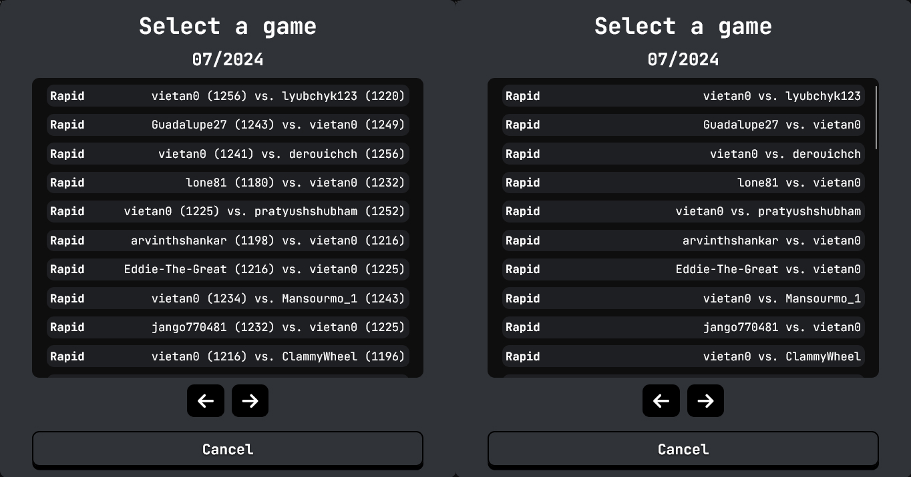
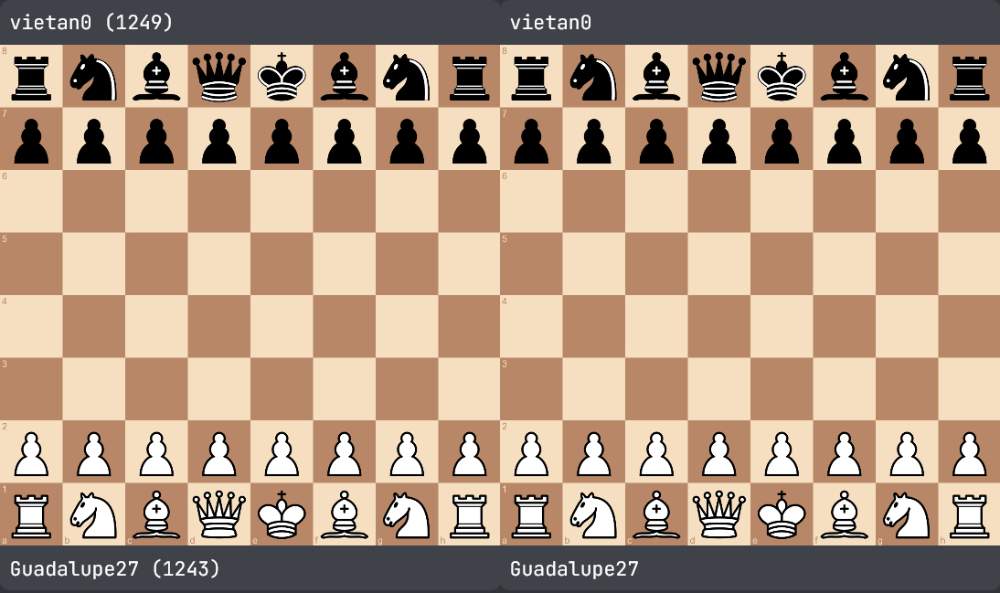

# Hide chess.com Ratings

Hide [chess.com](chess.com) and [Wintrcat's Game Review](https://chess.wintrcat.uk/) ratings to help you focus on playing at your best - without distraction.

## Screenshots

