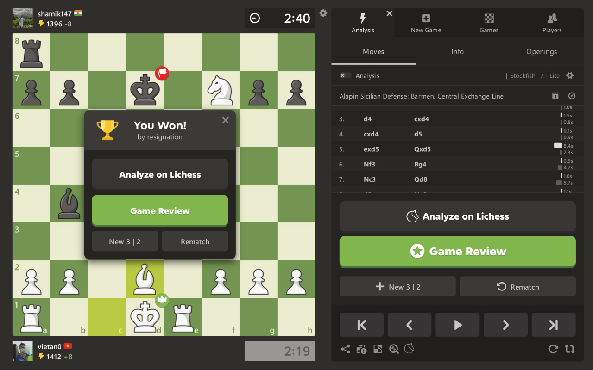

  

<h1 align="center">Chess.com Tweaks</h1>

Chess.com Tweaks is a browser extension that enhances your chess experience with a cleaner interface and additional analysis tools.

  <a href="https://addons.mozilla.org/en-US/firefox/addon/chesscom-tweaks/">
    <picture>
      <source srcset="https://i.imgur.com/ZluoP7T.png" media="(prefers-color-scheme: dark)">
    </picture>
  </a>
  <a href="https://chromewebstore.google.com/detail/chesscom-tweaks/bcpipkaoloecgjihcocbdnlkmcedjlcg">
    <picture>
      <source srcset="https://i.imgur.com/hcbQhpp.png" media="(prefers-color-scheme: dark)">
      </picture></a>
    <picture>
  </a>

  
  

## Features

### Hide Ratings

Hide all players' ratings in games and stats.

### Hide Opponent During Game

Hide opponent details (name, avatar, title, rating, etc.) when playing

### Hide Flags

Hide all country flags everywhere

### Hide Own Flag On Home

Hide the flag next to your username on the homepage

### Analyze on Lichess

Add buttons that send your finished games to the Lichess analysis page

### Opening Explorer

Add Lichess's opening explorer to Analysis page

### Analysis Link in Archive Games

Add a link in archive games to go straight to Analysis, not Game Review

