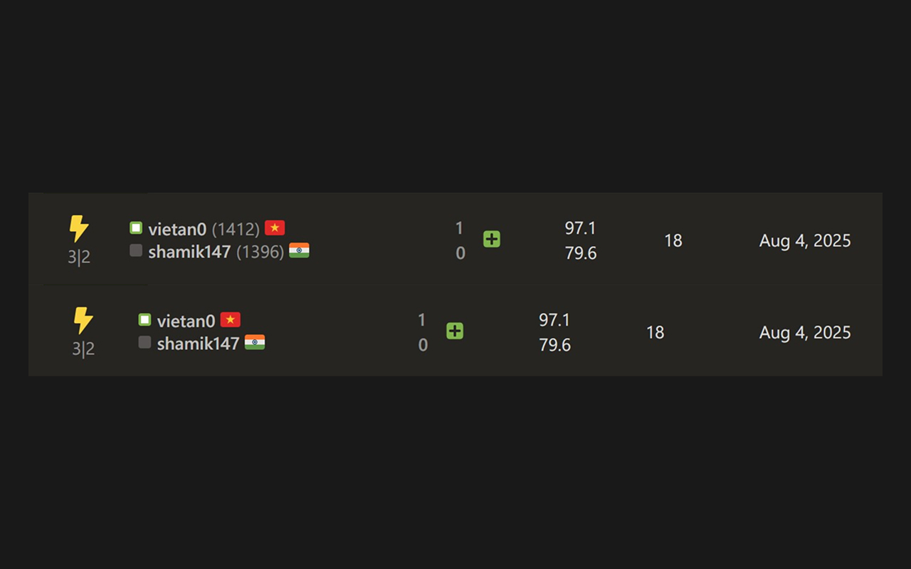
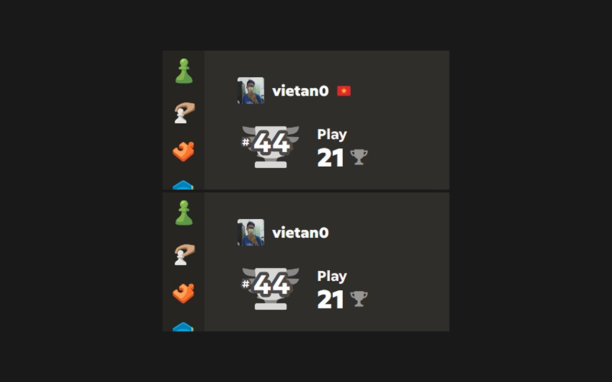

# Chess.com Tweaks - Hide ratings, hide opponent and more!

Chess.com Tweaks is a Firefox extension that helps you customize your Chess.com experience. It lets you hide all player ratings in games and stats, hide opponent details during live games, and hide all flags next to usernames, including your own on the homepage.

## Features

### Hide Ratings

Hide all players' ratings in games and stats.

### Hide Opponent During Game

Hide opponent details (name, avatar, title, rating, etc.) when playing

### Hide Flags

Hide all country flags everywhere

### Hide Own Flag On Home

Hide the flag next to your username on the homepage

